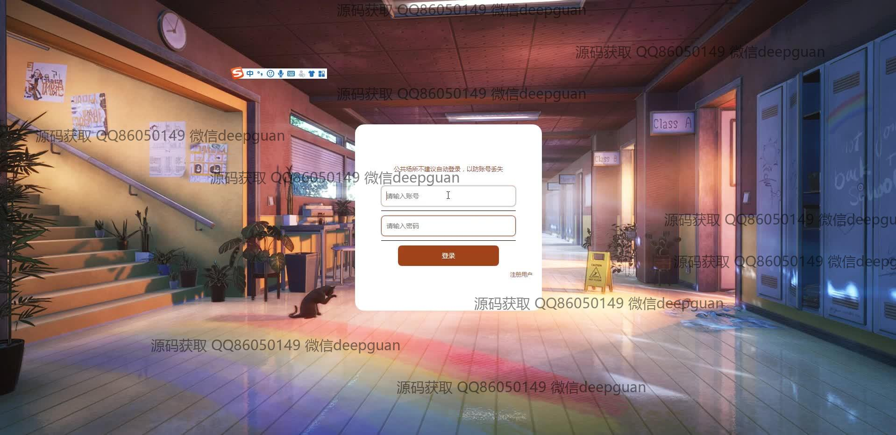

<h1 align="center">基于vue的MOBA类游戏攻略分享平台</h1>

## 简介
该系统是一个基于Spring Boot和Vue的MOBA类游戏攻略分享平台，角色分为管理员和用户，功能包括攻略发布与管理、论坛交流、用户互动、后台管理等，为用户提供便捷的策略分享和互动体验。    --计算机毕业设计源码；毕设源码；java毕业设计源码

## 联系方式

<h3 align="center">获取完整代码与数据库文件 + 微信：deepguan QQ: 86050149 QQ群: 783742310</h3>

<h3 align="center">可帮忙远程部署 包运行成功！提供远程部署、修改代码、设计文档指导、代码讲解等服务！</h3>

## 功能介绍（完整见运行截图）
管理员：提供用户管理、游戏攻略管理、公告管理、留言管理和论坛管理功能。后台界面包括查看、修改和删除帖子功能，并设有确认删除弹窗以增强操作安全性。用户可以通过导航菜单快速访问不同管理模块。

用户：用户可通过账号登录或注册，访问个人中心、上传攻略图片和视频，并撰写攻略内容。功能菜单包括首页、个人中心、游戏攻略、公告管理和收藏管理。用户可浏览、搜索及筛选攻略列表，并对内容进行点赞、评论、收藏等互动操作。

游客：游客可以浏览游戏攻略、新闻资讯、论坛帖子及留言板信息，但与注册用户不同，无需创建账户即可访问大部分公共内容。游客通过导航栏查找需要的信息，了解平台提供的服务和功能。

客服：客服聊天窗口提供即时用户咨询服务，帮助解决用户在使用平台时遇到的问题。用户可通过页面底部提供的联系方式进行电话或邮件联系，以获得额外支持。

## 运行截图

本代码来源于网络,仅供学习参考使用!

